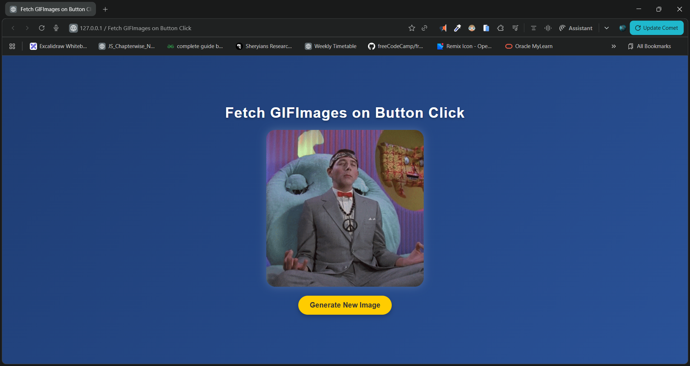

# 🎉 Fetch Random GIF Images – Giphy API Project

A simple, fun, and interactive web app that fetches a **random GIF** from the Giphy API every time the user clicks a button.
Built using **HTML, CSS, and JavaScript**, this mini-project is perfect for learning how to work with APIs and dynamic DOM updates.

---

## 📸 Preview

 

---

## 🔗 Live Demo


👉 **Live Project:** [https://dileep-kumawat.github.io/Fetch-Random-GIF-Images-using-html-css-and-js/](https://dileep-kumawat.github.io/Fetch-Random-GIF-Images-using-html-css-and-js/)

---

## 🎥 Demo Video


🎬 **Watch the Demo:** [click to watch](./demo.mp4)

---

## 💡 Features

✔️ Fetches random GIF images from Giphy
✔️ Beautiful UI with gradient background and glassmorphism
✔️ Loading state before GIF appears
✔️ One-click GIF generator
✔️ Fully responsive layout
✔️ Simple and beginner-friendly JS API example

---

## 🧪 How It Works

The app sends a request to the Giphy API:

```javascript
https://api.giphy.com/v1/gifs/random?api_key=YOUR_API_KEY&tag=funny
```

Then displays the returned GIF inside the UI dynamically.

---

## 🗂️ Project Structure

```
📁 Project Folder
 ├── index.html      # Main structure of the webpage
 ├── style.css       # UI design and layout
 └── script.js       # JS logic + API fetch
```

---

## 🧠 Code Highlights

### Fetching the GIF

```javascript
fetchData(url)
    .then(res => showImg(res.data.images["original"].url))
    .catch(err => console.error(err));
```

### Displaying the GIF

```javascript
function showImg(url) {
    div.innerHTML = "";
    let img = document.createElement("img");
    img.src = url;
    div.appendChild(img);
}
```

---

## 🚀 How to Use

1. Clone or download this repository
2. Open `index.html` in your browser
3. Click **Generate New Image**
4. Enjoy unlimited random GIFs 😄

---

## 📦 Installation (Optional with local server)

```bash
git clone https://github.com/Dileep-kumawat/Fetch-Random-GIF-Images-using-html-css-and-js.git
cd your-repo
```

Then simply open **index.html**.

---

## 🛠️ Technologies Used

* **HTML5**
* **CSS3 (Glassmorphism UI + Gradient background)**
* **JavaScript (Fetch API)**
* **Giphy API**

---

## 🧑‍💻 Author

Made with ❤️ by **Dileep kumawat**
- 📧 [dileepkumawat525@gmail.com](mailto:dileepkumawat525@gmail.com)
- 🔗 [LinkedIn](https://www.linkedin.com/in/dileep-kumawat/)

---